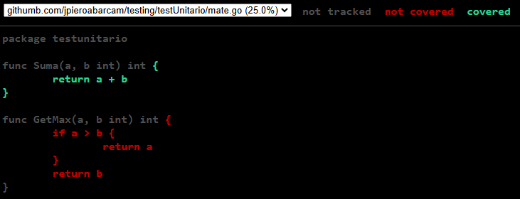
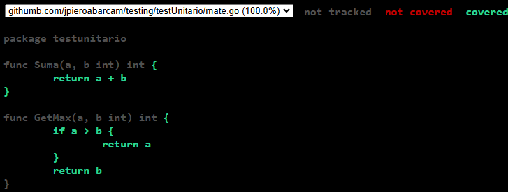
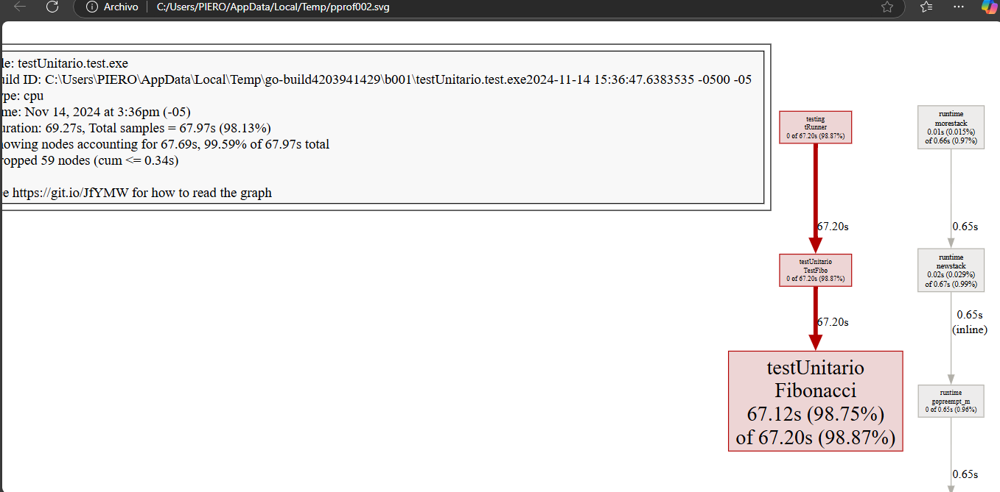

# Comandos para go testing
## En la carpeta tener un archivo <nombre>_test.go
    Directamente en la funcion direccionar los parametros de testing
    para ejecutar se requiere ejecutar en consola
```go
go test
```

Para ver si cubre la totalidad o parcialidad de funciones
```go
go test -cover
```

Para generar un archivo de salida
```go
go test -coverprofile=coverage
```

Mostrara el detalle de lo que salio en ese archivo de salida
```go
go tool cover -func=coverage 
```
```
githumb.com/jpieroabarcam/testing/testUnitario/mate.go:3:       Suma            100.0%
githumb.com/jpieroabarcam/testing/testUnitario/mate.go:7:       GetMax          0.0%
total:                                                          (statements)    25.0%
```

Mostrara pero en una pagina web lo que no se testea

```go
go tool cover -html=coverage
```
Caso de cuando no llega a testear la completitud de funciones



Cuando llega a testear toda la funcionalidad de la funcion


Cuando deseamos testear una funcion que tiene mucho tiempo

```go
go test -cpuprofile=cou


go tool pprof cou 
```
Mostrara en consola un gestor de pruebas para ver donde se quedo el testing

```cmd
File: testUnitario.test.exe
Build ID: C:\Users\PIERO\AppData\Local\Temp\go-build4203941429\b001\testUnitario.test.exe2024-11-14 15:36:47.6383535 -0500 -05
Type: cpu
Time: Nov 14, 2024 at 3:36pm (-05)
Duration: 69.27s, Total samples = 67.97s (98.13%)
Entering interactive mode (type "help" for commands, "o" for options)
```
ingresamos la opcion `top`
```cmd
(pprof) top
Showing nodes accounting for 67.69s, 99.59% of 67.97s total
Dropped 59 nodes (cum <= 0.34s)
Showing top 10 nodes out of 12
      flat  flat%   sum%        cum   cum%
    67.12s 98.75% 98.75%     67.20s 98.87%  githumb.com/jpieroabarcam/testing/testUnitario.Fibonacci
     0.52s  0.77% 99.51%      0.52s  0.77%  runtime.stdcall1
     0.02s 0.029% 99.54%      0.67s  0.99%  runtime.newstack
     0.02s 0.029% 99.57%      0.54s  0.79%  runtime.semawakeup
     0.01s 0.015% 99.59%      0.66s  0.97%  runtime.morestack
         0     0% 99.59%     67.20s 98.87%  githumb.com/jpieroabarcam/testing/testUnitario.TestFibo
         0     0% 99.59%      0.65s  0.96%  runtime.gopreempt_m (inline)
         0     0% 99.59%      0.65s  0.96%  runtime.goschedImpl
         0     0% 99.59%      0.54s  0.79%  runtime.notewakeup
         0     0% 99.59%      0.54s  0.79%  runtime.startm
```

Luego la opcion `list` mas la funcion a observar en este caso `Fibonacci`

```cmd
(pprof) list Fibonacci
Total: 67.97s
ROUTINE ======================== githumb.com/jpieroabarcam/testing/testUnitario.Fibonacci in C:\Users\PIERO\Documents\Repositorios\UdemyBusiness\golang\pruebas\Testing\testUnitario\mate.go
    67.12s     98.61s (flat, cum) 145.08% of Total
    20.83s     20.87s     14:func Fibonacci(n int) int {
    67.12s     98.61s (flat, cum) 145.08% of Total
    20.83s     20.87s     14:func Fibonacci(n int) int {
     7.47s      7.47s     15:   if n <= 1 {
     3.07s      3.07s     16:           return n
         .          .     17:   }
    35.75s     67.20s     18:   return Fibonacci(n-1) + Fibonacci(n-2)
         .          .     19:}
(pprof) web
failed to execute dot. Is Graphviz installed? Error: exec: "dot": executable file not found in %PATH%
(pprof) quit
    67.12s     98.61s (flat, cum) 145.08% of Total
    20.83s     20.87s     14:func Fibonacci(n int) int {
     7.47s      7.47s     15:   if n <= 1 {
     3.07s      3.07s     16:           return n
         .          .     17:   }
    35.75s     67.20s     18:   return Fibonacci(n-1) + Fibonacci(n-2)
    67.12s     98.61s (flat, cum) 145.08% of Total
    20.83s     20.87s     14:func Fibonacci(n int) int {
     7.47s      7.47s     15:   if n <= 1 {
     3.07s      3.07s     16:           return n
    67.12s     98.61s (flat, cum) 145.08% of Total
    20.83s     20.87s     14:func Fibonacci(n int) int {
     7.47s      7.47s     15:   if n <= 1 {
    67.12s     98.61s (flat, cum) 145.08% of Total
    67.12s     98.61s (flat, cum) 145.08% of Total
    20.83s     20.87s     14:func Fibonacci(n int) int {
     7.47s      7.47s     15:   if n <= 1 {
     3.07s      3.07s     16:           return n
         .          .     17:   }
    35.75s     67.20s     18:   return Fibonacci(n-1) + Fibonacci(n-2)
         .          .     19:}
```

## Instalar el graphviz
Descargar para el sistema operativo necesario e instalar
luego escribimos 
```cmd
(pprof) web
```


o en todo caso se quiere compartirlo en pdf

```cmd
(pprof) pdf
```
Para visualizarlo recordar salir de pprof
```cmd
(pprof) quit
```